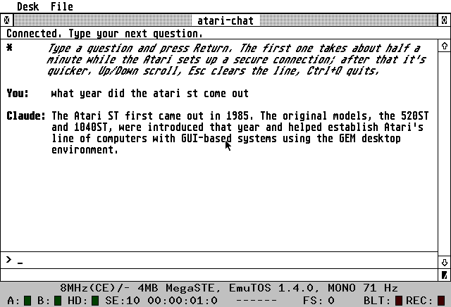

# atari-chat

A chat client for Claude that runs on an Atari ST, as a GEM app in C.



Everything happens on the 8 MHz 68000: TLS 1.2 (X25519 key exchange, RSA
certificate checks, ChaCha20-Poly1305), HTTP/1.1 and JSON. The only thing
outside the Atari is a modem that turns the serial port into a TCP
connection: a WiFi modem on real hardware, or a small emulator script under
[Hatari](https://hatari.frama.io/).

Requests go through [Cloudflare AI Gateway](https://developers.cloudflare.com/ai-gateway/)'s
OpenAI-compatible endpoint, so any model the gateway offers works.

## What you need

- Linux on x86_64. It was developed on Arch; any distribution should work.
- `hatari`, `python3`, `make`, `curl`, `git`
- The m68k Atari cross compiler (GCC 15). The install script below fetches it.
- A Cloudflare account with an AI Gateway.

## Setup

```sh
git clone --recursive git@github.com:matthewp/atari-chat.git
cd atari-chat

# Cross compiler + Atari libraries into ~/.local/opt/cross-mint (no root)
tools/install-toolchain.sh

# The emulator (Arch; use your distro's package elsewhere)
sudo pacman -S hatari
```

The EmuTOS ROM (a free TOS replacement) is included in `emu/`, so no Atari
ROM image is needed.

### Credentials

```sh
cp .env.example .env
```

Fill in `.env`:

| Setting | What it is |
|---|---|
| `AIG_ACCOUNT_ID` | Your Cloudflare account ID |
| `AIG_GATEWAY` | The gateway's name |
| `AIG_MODEL` | Model in `provider/model` form, e.g. `anthropic/claude-sonnet-5` |
| `AIG_TOKEN` | A Cloudflare API token, sent as `cf-aig-authorization` |
| `PROVIDER_API_KEY` | The provider's key. Leave it empty with Unified Billing or keys stored in the gateway. |

The simplest setup is **Unified Billing**: Cloudflare pays the provider from
your credits, so no provider key is needed. Turn on authentication for the
gateway, then create an API token that only has AI Gateway permissions.

The values are compiled into the program (through the generated
`obj/config.h`); they never go into `src/`. **Anyone with the built
`ATCHAT.PRG` can extract the token**, so don't share builds. Keep the token
limited to AI Gateway and revoke it if a build gets out.

## Build and run

```sh
make run
```

This builds everything, starts the modem emulator, and boots Hatari as a
Mega STE (at 8 MHz, with 4 MB and a monochrome monitor). The `build/` folder
is the Atari's drive **C:**. On the desktop, open C: and double-click
**`ATCHAT.PRG`**.

Other targets:

| Command | Does |
|---|---|
| `make` | Builds the test programs, which don't need `.env` |
| `make chat` | Builds `ATCHAT.PRG` and `CHAT.TOS` (needs `.env`) |
| `make clean` | Removes `build/` and `obj/` |
| `make compile_flags.txt` | Editor support: tells clangd where the Atari headers are |

In Hatari the mouse is captured; **right Alt + M** releases it. **F12** opens
Hatari's menu, which also takes screenshots (they go to `screenshots/`).

## Using the app

Type a question and press **Return**.

- **Startup:** about 8 s to prepare encryption keys.
- **First question:** about 30 s. The Atari dials, does the TLS handshake
  (~12 s), and checks the server's identity (~7 s) before it sends anything
  secret.
- **Follow-ups** reuse the connection, so you only wait for Claude.
- **After a long pause,** it reconnects automatically.

The line under the title bar shows what it's doing.

| Key | Action |
|---|---|
| Return | Send |
| Backspace / Esc | Delete a character / clear the line |
| Up / Down, scroll bar | Scroll the conversation |
| Clr/Home | Jump to the top |
| Ctrl+Q, File > Quit | Quit |

## Time and certificates

Checking a server certificate needs the correct date. A 1040 STE has no
battery clock, so set the date in the Control Panel after booting. If the
date is unset (before 2025), the app refuses to connect. The emulated Mega
STE has a clock, set from your PC's time.

The first connection checks the full certificate chain (about a minute). The
result is remembered in `C:\TLSCACHE.DAT` until the server's certificate
changes, so later connections only check the key-exchange signature.

## How it works

```
ATCHAT.PRG (GEM)  ->  HTTP/JSON  ->  TLS (BearSSL + 68000 assembly)  ->  serial port
    ->  Hatari RS-232  ->  tools/modem.py (Hayes AT commands)  ->  TCP  ->  AI Gateway
```

- **Serial and modem** (`src/serial.c`, `src/modem.c`, `tools/modem.py`):
  - 19200 baud with a 16 KB receive buffer swapped into the BIOS.
  - `ATDT host:port` to dial.
  - `modem.py` behaves like a WiFi modem: it moves bytes and nothing else.
- **TLS** (`src/tls/`) is BearSSL, restricted to one cipher suite:
  ECDHE-RSA-CHACHA20-POLY1305 over X25519.
- **X25519** (`src/x25519/`) uses a field multiply written in 68000
  assembly, generated by `tools/gen_fe16.py`. It takes 8 s, where BearSSL's
  C version takes 32 s.
- **RSA** (`src/rsa/`) is Montgomery arithmetic with an assembly inner loop.
  RSA-2048 takes 7 s (BearSSL: 25 s).
- **Fitting Cloudflare's timeouts.** Cloudflare wants the handshake, and the
  first HTTP request, within about 15 s of connecting. So the Atari:
  - generates its key pair *before* dialing;
  - saves the certificates and signatures during the handshake, and checks
    them only afterwards (`src/tls/deferred.c`);
  - sends a harmless `GET /` to meet the deadline;
  - sends the real request, with the token, only once the server is
    verified.
- **HTTP** (`src/http.c`) is HTTP/1.1 with keep-alive and chunked
  responses.
- **JSON** (`src/json.c`) is a streaming parser that pulls out only the
  reply text as bytes arrive.
- **Character set** (`src/charset.c`) converts between UTF-8 and the Atari
  ST character set.
- **The app** (`src/app/`) is the GEM window, the word-wrapped transcript,
  and the connection manager.

## Test programs

`make` also builds these into `build/`, runnable from drive C:

| Program | Tests |
|---|---|
| `NETTEST.TOS` | Dials out and fetches `http://example.com/` (the plain serial/modem path) |
| `TLSBENCH.TOS` | Times BearSSL's crypto primitives on the 68000 |
| `X25519T.TOS` | Checks the assembly X25519 against C and the RFC 7748 vectors, then times it |
| `RSATEST.TOS` | Checks the assembly RSA loop against C, then times it |
| `TLSTEST.TOS` | Handshake with AI Gateway, then full verification |
| `CHAT.TOS` | One question and answer in a text console (needs `.env`) |

The `tests/` folder holds checks that run on Linux against Python reference
implementations (X25519, RSA, JSON). The commands are in `CLAUDE.md`.

`tools/snap.py` runs a program in a hidden Hatari and saves a screenshot,
which is handy for automated checks.

## Real hardware

It should run on any ST with 1 MB or more and a serial WiFi modem that
understands `ATDT host:port` (for example, Zimodem firmware), at 19200 baud.
It hasn't been tested on real hardware yet. Two known gaps:

- **Flow control.** It doesn't yet use RTS/CTS hardware flow control. The
  16 KB buffer covers the emulator, but a real modem should be set to pace
  its output.
- **The date.** Set it before connecting (see above).

## Licenses

- BearSSL (`third_party/bearssl`, a git submodule): MIT license.
- EmuTOS (`emu/etos256us.img`): GPL; see `emu/EMUTOS-README.txt`.
